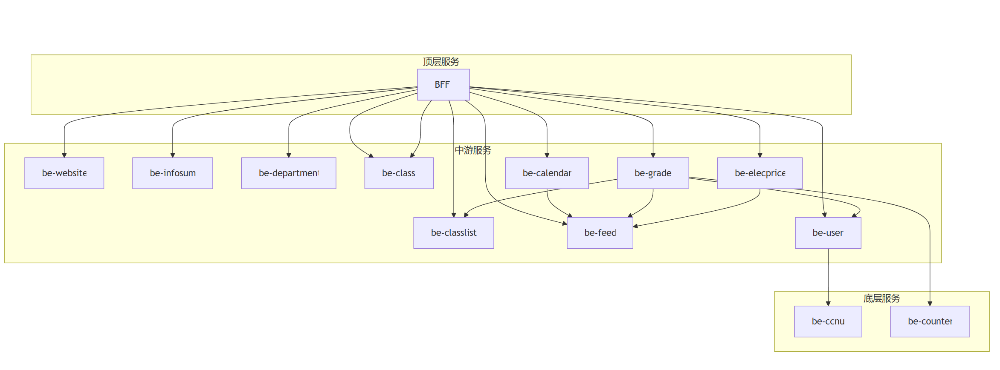

# 华师匣子后端

[TOC]

## 一、简述

`ccnubox-be` 是华师匣子后端项目，提供了多个模块的功能支持，包括日历、信息汇总、部门管理、课程管理、电费提醒、订阅管理、问题管理、成绩查询、静态数据管理以及网站管理等功能模块。

## 二、组成模块

**模块解释**
- **`be-api`** : 定义了各个微服务的API，主要由protobuf定义
- **`be-banner`** : banner服务，管理banner
- **`be-calendar`** : 日历服务，管理日历
- **`be-ccnu`**: CCNU服务，管理CCNU一站式登录服务
- **`be-class`**: 课程服务，提供蹭课功能,以及空闲教室的查询
- **`be-classlist`**: 课表服务，管理课表的增删查改等功能
- **`be-counnter`**: 区分是否是核心用户服务
- **`be-department`** : 部门服务，管理部门信息
- **`be-elecprice`**: 电费服务，管理电费信息
- **`be-feed`**: feed服务，管理消息推送服务
- **`be-grade`**: 成绩服务，管理成绩查询服务
- **`be-infosum`**: 信息汇总服务，管理信息汇总服务
- **`be-user`**: 用户服务，为其他服务提供cookie
- **`be-website`**: 网站服务，管理网站信息
- **`bff`**: 提供给前端使用的api


**各个服务对应默认端口**

| 服务          | 默认端口 |
| ------------- | -------- |
| be-banner     | 19080    |
| be-calendar   | 19081    |
| be-ccnu       | 19082    |
| be-class      | 19083    |
| be-classlist  | 19084    |
| be-counter    | 19085    |
| be-department | 19086    |
| be-elecprice  | 19087    |
| be-feed       | 19088    |
| be-grade      | 19089    |
| be-infosum    | 19090    |
| be-user       | 19091    |
| be-website    | 19092    |
| bff           | 8080     |


**项目架构示意图**


**工具文件/目录**

**`build-{service}.sh`** : 用来构建`service`服务镜像的脚本文件

**`build-all.sh`** : 用来构建所有服务镜像的脚本文件

**`deploy/`** : 部署相关文件


## 三、依赖组件

+ **`etcd`** : 注册中心，承担服务注册与发现的职责
+ **`mysql`** : 数据库，存储数据
+ **`redis`** : 用作缓存，并提供分布式锁的功能
+ **`kafka`** ： 消息队列
+ **`ElasticSearch`** : 为部分服务提供搜索功能


## 四、如何运行？

这里只提供在`docker`中的快速搭建

复制`deploy/docker/docker-compose.yaml`

```yaml
services:
  be-banner:
    container_name: be-banner
    image: be-banner:v1
    restart: "always"
    network_mode: host
    volumes:
      - ./logs/be-banner/:/logs/
      - ./configs/be-banner.yaml:/data/conf/config.yaml
  be-calendar:
    container_name: be-calendar
    image: be-calendar:v1
    restart: "always"
    network_mode: host
    volumes:
      - ./logs/be-calendar/:/logs/
      - ./configs/be-calendar.yaml:/data/conf/config.yaml
  be-ccnu:
    container_name: be-ccnu
    image: be-ccnu:v1
    restart: "always"
    network_mode: host
    volumes:
      - ./logs/be-ccnu/:/logs/
      - ./configs/be-ccnu.yaml:/data/conf/config.yaml
  be-class:
    container_name: be-class
    image: be-class:v1
    restart: "always"
    network_mode: host
    volumes:
    #   - ./logs/be-class/:/logs/
      - ./configs/be-class.yaml:/data/conf/config.yaml
      - ./configs/classrooms.json:/data/conf/classrooms.json
  be-classlist:
    container_name: be-classlist
    image: be-classlist:v1
    restart: "always"
    network_mode: host
    volumes:
      - ./logs/be-classlist/:/logs/
      - ./configs/be-classlist.yaml:/data/conf/config.yaml
  be-counter:
    container_name: be-counter
    image: be-counter:v1
    restart: "always"
    network_mode: host
    volumes:
      - ./logs/be-counter/:/logs/
      - ./configs/be-counter.yaml:/data/conf/config.yaml
  be-department:
    container_name: be-department
    image: be-department:v1
    restart: "always"
    network_mode: host
    volumes:
      - ./logs/be-department/:/logs/
      - ./configs/be-department.yaml:/data/conf/config.yaml
  be-elecprice:
    container_name: be-elecprice
    image: be-elecprice:v1
    restart: "always"
    network_mode: host
    volumes:
      - ./logs/be-elecprice/:/logs/
      - ./configs/be-elecprice.yaml:/data/conf/config.yaml
  be-feed:
    container_name: be-feed
    image: be-feed:v1
    restart: "always"
    network_mode: host
    volumes:
      - ./logs/be-feed/:/logs/
      - ./configs/be-feed.yaml:/data/conf/config.yaml
  be-grade:
    container_name: be-grade
    image: be-grade:v1
    restart: "always"
    network_mode: host
    volumes:
      - ./logs/be-grade/:/logs/
      - ./configs/be-grade.yaml:/data/conf/config.yaml
  be-infosum:
    container_name: be-infosum
    image: be-infosum:v1
    restart: "always"
    network_mode: host
    volumes:
      - ./logs/be-infosum/:/logs/
      - ./configs/be-infosum.yaml:/data/conf/config.yaml
  be-user:
    container_name: be-user
    image: be-user:v1
    restart: "always"
    network_mode: host
    volumes:
      - ./logs/be-user/:/logs/
      - ./configs/be-user.yaml:/data/conf/config.yaml
  be-website:
    container_name: be-website
    image: be-website:v1
    restart: "always"
    network_mode: host
    volumes:
      - ./logs/be-website/:/logs/
      - ./configs/be-website.yaml:/data/conf/config.yaml
  bff:
    container_name: bff
    image: bff:v1
    restart: "always"
    network_mode: host
    volumes:
      - ./logs/bff/:/logs/
      - ./configs/bff.yaml:/data/conf/config.yaml


```


可以看到其中的挂载文件，有相关的配置文件，这个你可以从各个服务里面找到相应的配置文件，根据你的需要做修改即可

最后你的文件结构应该是这样

```
.
├── configs
│   ├── be-banner.yaml
│   ├── be-calendar.yaml
│   ├── be-ccnu.yaml
│   ├── be-classlist.yaml
│   ├── be-class.yaml
│   ├── be-counter.yaml
│   ├── be-department.yaml
│   ├── be-elecprice.yaml
│   ├── be-feed.yaml
│   ├── be-grade.yaml
│   ├── be-infosum.yaml
│   ├── be-user.yaml
│   ├── be-website.yaml
│   ├── bff.yaml
│   └── classrooms.json
├── docker-compose.yaml
└── logs
```

注意你需要准备好对应的基础组件

然后执行

```bash
docker compose up -d
```

## 五、API文档

想查看API文档，可以到[这里](./bff/docs/)
